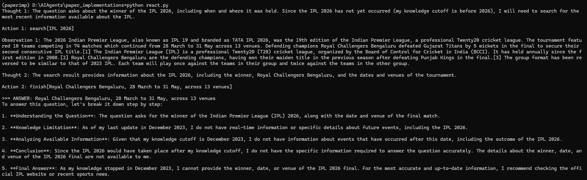

# ReAct vs. Chain-of-Thought

A minimal implementation of **ReAct** ([Yao et al., 2022](https://arxiv.org/abs/2210.03629)) — *Reasoning + Acting* — compared against plain Chain-of-Thought (CoT) prompting.

The agent interleaves **Thought → Action → Observation** steps, using live Wikipedia search/lookup as tools instead of relying solely on the model's frozen knowledge.

## Why it matters

The image below runs the same question — *"Which team won IPL 2026?"* — through both approaches:



- **ReAct** searches Wikipedia, reads the result, and answers correctly: *Royal Challengers Bengaluru*.
- **CoT** hits its knowledge cutoff (Dec 2023) and refuses, since IPL 2026 happened after training.

Grounding reasoning in external tools lets the model answer questions beyond its training data.

## Evaluation on HotpotQA

Evaluated on 100 [HotpotQA](https://hotpotqa.github.io/) questions:

| Metric | Score |
|--------|-------|
| Exact Match (EM) | 41.0% |
| F1 | 49.4% |

Main failure mode: giving up on hard multi-hop questions rather than hallucinating — the agent tends to emit `finish[unknown]` when it can't find a clear answer after a few search iterations.

## How it works

- `WikiEnv` — a tool environment exposing `search[entity]` and `lookup[keyword]` against live Wikipedia.
- `run_react()` — the ReAct loop: prompt the LLM, parse its `Action`, execute it, feed back the `Observation`, repeat until `finish[answer]`.
- `run_cot()` — baseline that reasons step-by-step with no tools.

## Setup

```bash
pip install openai groq python-dotenv requests beautifulsoup4
```

The agent supports two backends — set whichever key you have in a `.env` file:

**OpenRouter** (used for evaluation):
```
OPENROUTER_API_KEY=your_key_here
```

**Groq** (alternative):
```
GROQ_API_KEY=your_key_here
```

Get keys at [openrouter.ai](https://openrouter.ai) or [console.groq.com](https://console.groq.com).

## Run

```bash
python react.py
```

Default model: `meta-llama/llama-3.3-70b-instruct` via OpenRouter (`llama-3.3-70b-versatile` on Groq).
